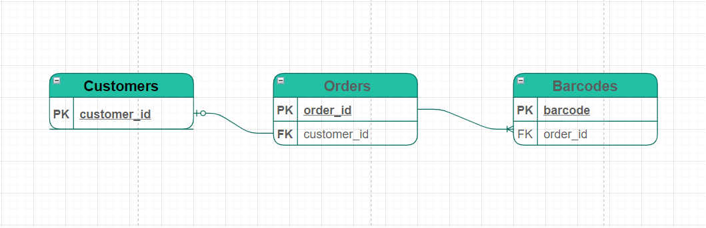

CSV files Parser:
----------------

Read two input csv files and write into stdout, by following way:\
[tab]customer_id, order_id1, [barcode1, barcode2, ...]\
[tab]customer_id, order_id2, [barcode1, barcode2, ...]

[tab]columns(order.csv):  customer_id, order_id\
[tab]columns(barcodes.csv): order_id, barcode

ER Diagram:
----------

* Orders entity conected with Customers entity by Many to One relationship (1:M)
* Barcodes entity connected with Orders entity by Many to One relationship (1:M)

Validation:
----------

    1. No duplicate barcodes
    2. No orders without barcodes    
  Items which failed the validation should be logged and being ignored in further

Constrains:
----------

    1. This should work with very big input files.
    2. This should be able to hanlde very big files in parallel.
    3. This should provide TOP 5 customers, by following format:
                customer_id, amount_of_tickets
    4. Print the amount of unused barcodes (barcodes left).

Requirements:
------------
    dask
    bokeh>=0.13.0
    "dask[distrubuted]"

Usage:
-----

    usage: solution.py [-h] [-input_order INPUT_ORDER] [-input_barcode INPUT_BARCODE]

    optional arguments:
      -h, --help            show this help message and exit
      -input_order INPUT_ORDER
                            Input order csv file path
      -input_barcode INPUT_BARCODE
                            Input barcode csv file path

                    